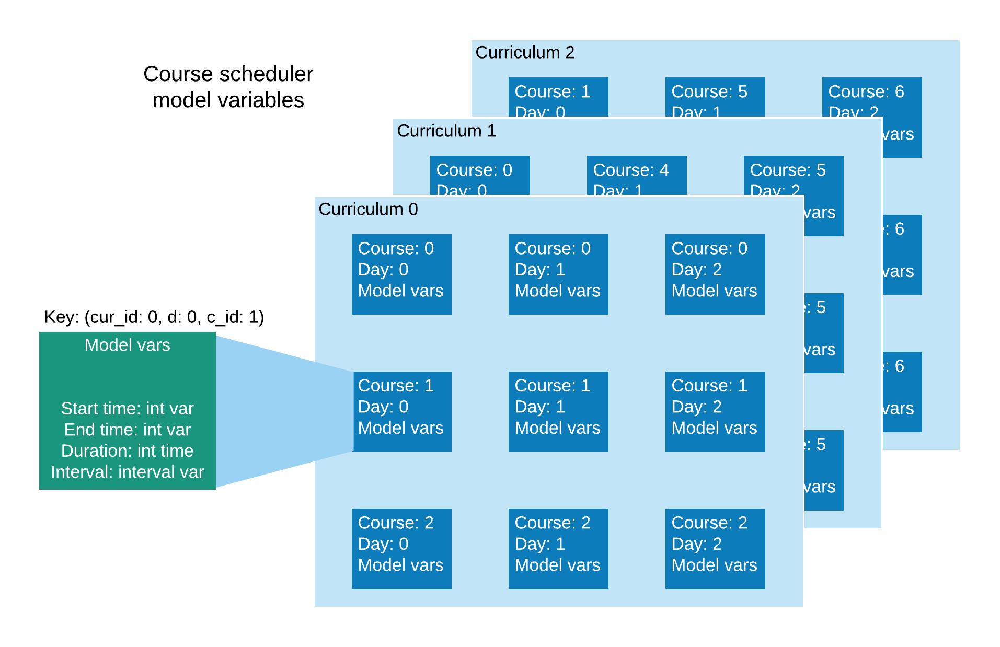

# How does the scheduler work?

The scheduler uses CP-SAT solver from OR-Tools Python package. Using the solver allows us to avoid thinking about the heuristics of searching for the feasible/optimal schedule, and focus on constraints and scoring criteria for the feasible/optimal schedule that the scheduler outputs.

Once the variables representing the search space and constraints on those variables are defined, we can use the CP-SAT solver to find the solution heuristically.

## Model variables

The most important part of the scheduler is CP-SAT model ([CPModel](https://developers.google.com/optimization/reference/python/sat/python/cp_model#cpmodel)) and its model variables. See more on the basics of CP-SAT model [here](https://developers.google.com/optimization/cp/cp_solver). All model variables can be thought of as a 3D space representing possible schedules. The axes of this space are:
* Curriculum identifier (e.g. computer science, electrical engineering etc.)
* Day of the week
* Course identifier

In code, these variables are often named `cur_id`, `d` and `c_id` respectively.

Each point in this space (unique combination of curriculum id, day and course id) contains variables defining a lecture for a particular course from a particular curriculum on a particular day. These variables are:

* Start ([int var](https://developers.google.com/optimization/reference/python/sat/python/cp_model#newintvar)): time when thecourse lecture starts
* End (int var): time when the lecture ends
* Duration (int var): duration of the lecutre
* Interval ([interval var](https://developers.google.com/optimization/reference/python/sat/python/cp_model#newintervalvar)): a special variable that is also a constrain ensuring `start + duration == end`

This structure implies that each course can have only one lecture per day. Since these model variables are defined for every course for every day of the week and courses don't usually take place every day, the model can simply set `duration = 0` and `start = end` to indicate that the course does not take place.

The diagram below visualizes the possible model state. This model assumes that there are 3 days a week, the courses are scheduled for 3 curricula and there are 3 courses per curricula. Notice that courses can be shared across curricula (e.g. course 0 is present in both curriculum 0 and 1; course 5 is present in both curriculum 1 and 2).



## Constraints

After model variables are created, various constraints can be defined on those variables.

### Bounded linear expression

The most simple form of constrain is a bounded linear expression of [the following form](https://developers.google.com/optimization/reference/python/sat/python/cp_model#cp_model.BoundedLinearExpression). These expressions are added using [Add](https://developers.google.com/optimization/reference/python/sat/python/cp_model#add) method of the model.

#### Example

For instance, if we want to ensure that each course has exactly 5 periods scheduled every week, we can add the following constraint (see `add_course_len_constraints` in code for more accurate example):

```python
model.Add(sum([duration vars for every day of the week for a specific course) == 5)
```

### No overlap

The second type of constraints is [NoOverlap](https://developers.google.com/optimization/reference/python/sat/python/cp_model#addnooverlap) constraint. It is used exclusibely with interval variables to insure that intervals do not overlap with each other.

#### Example

For instance, this type of constraints is used ensure that courses of the same curriculum happening on the same day do not overlap in time (see `add_no_overlap_constraints` for details):

```python
model.AddNoOverlap([intervals of all courses of a particular curriculum on a particular day])
```

### Boolean formulae

It is possible to create complex constraints by combining bounded linear expressions into boolean formulae. This requires us to create additional boolean model variables, that indicate whether a bounded linear expression constraint is satisfied, and combine these boolean variables into boolean formulae using logic gates such as: [AND](https://developers.google.com/optimization/reference/python/sat/python/cp_model#addbooland), [OR](https://developers.google.com/optimization/reference/python/sat/python/cp_model#addboolor) and [XOR](https://developers.google.com/optimization/reference/python/sat/python/cp_model#addboolxor).

#### Example

For instance, we want to ensure that either course `A` has a lecture with duration 6 on Monday or course `B` has a lecture with duration 4 on Monday, but not both, *and* course `C` duration on Monday is always 3. This can be expressed as:

```
(duration of A on Monday == 6 XOR duration of B on Monday == 4) AND duration of C on Monday == 3
```

The way to define such expression in a model is quite verbose, especially for boolean formulae with lots of variables and logic operations.

In the following example, `duration_a` is a Duration model variable for course A on Monday and so on.

```python3
bool_a = model.NewBoolVar('bool_a') # create a boolean variable for A

# formally, this means `bool_a => duration_a == 6`
# i.e. if `duration_a == 6` is true then make `bool_a` true and vice versa
model.Add(duration_a == 6).OnlyEnforceIf(bool_a)

bool_b = model.NewBoolVar('bool_b') # create a boolean variable for B
model.Add(duration_b == 4).OnlyEnforceIf(bool_b)


bool_xor = model.NewBoolVar('bool_xor') # create a boolean variable for the XOR result

# supply `bool_a` and `bool_b` as inputs to a XOR gate. Write result to `bool_xor`
model.AddBoolXOr([bool_a, bool_b]).OnlyEnforceIf(bool_xor)

bool_c = model.NewBoolVar('bool_c') # create a boolean variable for C
model.Add(duration_c == 3).OnlyEnforceIf(bool_c)

# supply `bool_c` and `bool_xor` as inputs to a AND gate
# since we haven't added enforcement literal,
# this constraint has to be satisfied in every feasible solution
model.AddBoolAnd([bool_c, bool_xor])
```

## Running the solver

### Initialization

Before running the solver, the course scheduler needs to be initialized (this process, for the most part, consists of creating model variables):

```python
n_periods = 26  # 30-min increments in a 8:30 to 21:30 day
n_days = 5      # 5 working days per week

# create courses for one curriculum
c1 = Course("0UoeRGKWlpKzZgs7", 6)
c2 = Course("FQJSAdpeIy9rJU1H", 6)
c3 = Course("8sMA05cToLsEKB3y", 4)
c4 = Course("BbjRKtortAflVFLL", 6)
courses0 = [c1, c2, c3, c4]

# create courses for another curriculum
c5 = Course("hFUhTu8WIEeQEQ3i", 4)
c6 = Course("YlFH40I1LBgH9vEI", 6)
c7 = Course("jWtVT6TsTjz0lFQb", 6)
courses1 = [c4, c5, c6, c7]

cur0 = Curriculum("hXkY1ChCPUcdRMbz", courses0)
cur1 = Curriculum("yGGLYSENM97GC0A3", courses1)
curricula = [cur0, cur1]

sched = CourseSched(n_days, n_periods, curricula) # this initializes model variables
```

### Adding constraints

We then add constraints. See each method docstring to find out what each constraint does.

```python
sched.add_no_overlap_constraints()
sched.add_course_len_constraints()
sched.add_lecture_len_constraints()
sched.add_sync_across_curricula_constraints()
sched.add_lecture_symmetry_constraints()

sched.add_unavailability_constraints("hFUhTu8WIEeQEQ3i", 2, [(0, 4), (6, 9)])
sched.add_unavailability_constraints("hFUhTu8WIEeQEQ3i", 4, [(4, 9)])
sched.add_unavailability_constraints("jWtVT6TsTjz0lFQb", 3, [(10, 14), (16, 19)])
```

### Callbacks

Finally, before running the solver, we need to initialize a solver solution callback. This callback is our main means of communication with the solver once it is started.

This callback has to be a class that inherits from `cp_model.CpSolverSolutionCallback` and is passed to the model's `solve` method. I.e.:

```python
callback = SomeSolutionCallback(...)
sched.solve(callback)
```

The class that inherits from `cp_model.CpSolverSolutionCallback` has to define `on_solution_callback` method. This method will be called for each feasible solution that the solver finds.

There's currently three types of callback classes:

* `SolverCallbackUtil` is a wrapper around `cp_model.CpSolverSolutionCallback` that contains methods that would be useful for all other custom callbacks. It currently has only `sol_to_str` method that returns a pretty string representation of a solution. This is helpful when debugging the scheduler. It is suggested to inherit from this class when creating other callback classes.
* `SchedPartialSolutionPrinter` simply prints the string returned by `sol_to_str` to stdout. Good for development.
* `SchedPartialSolutionSerializer` serializes solution such and stores the representation in a dict. This is used by the API to return the solution to the client. See `examples/example_sched_response.json` for the serialization format.

